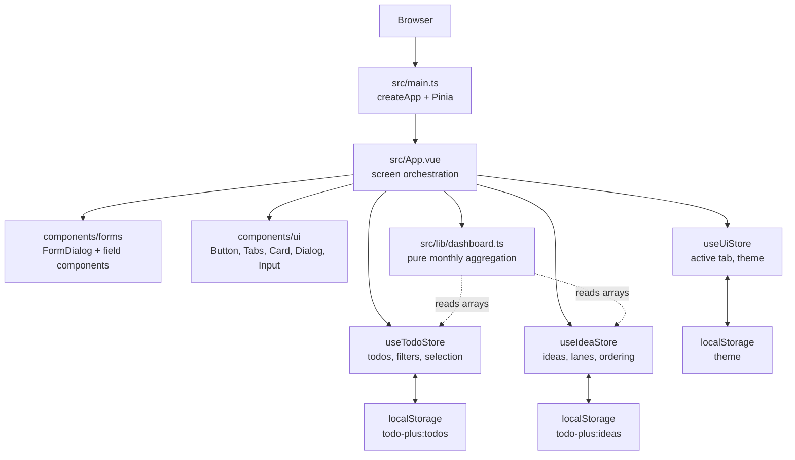
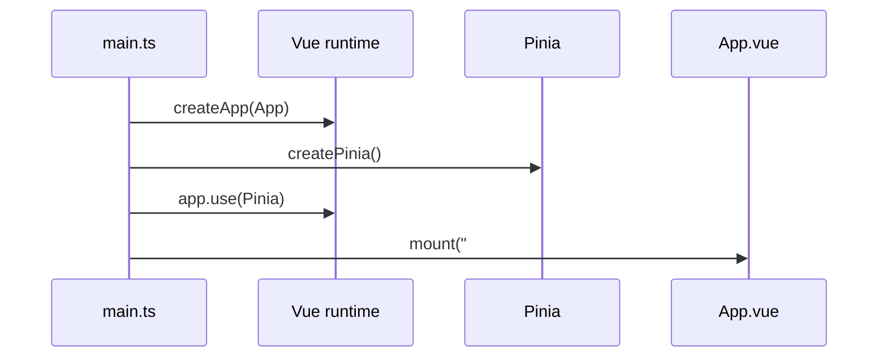
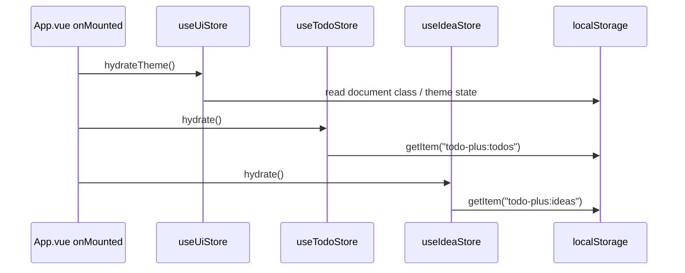
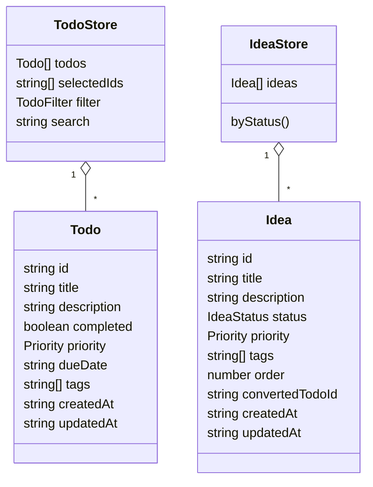
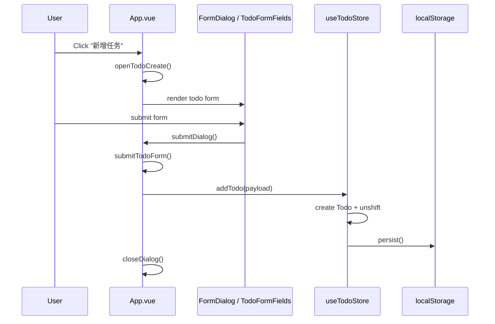
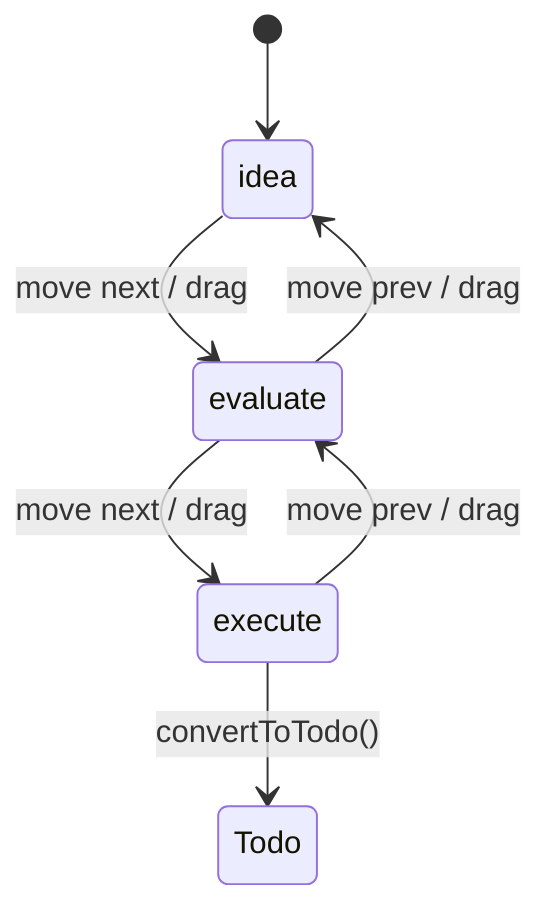
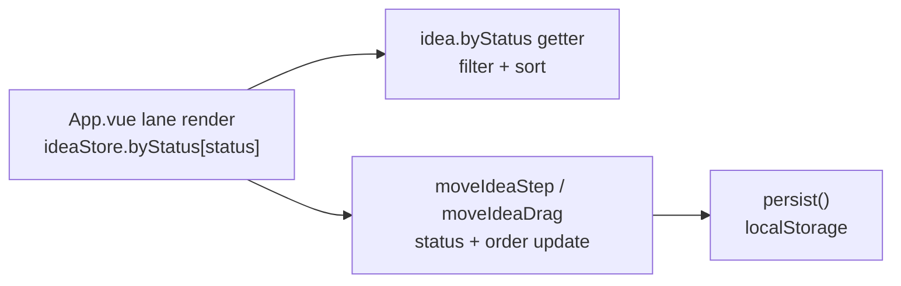
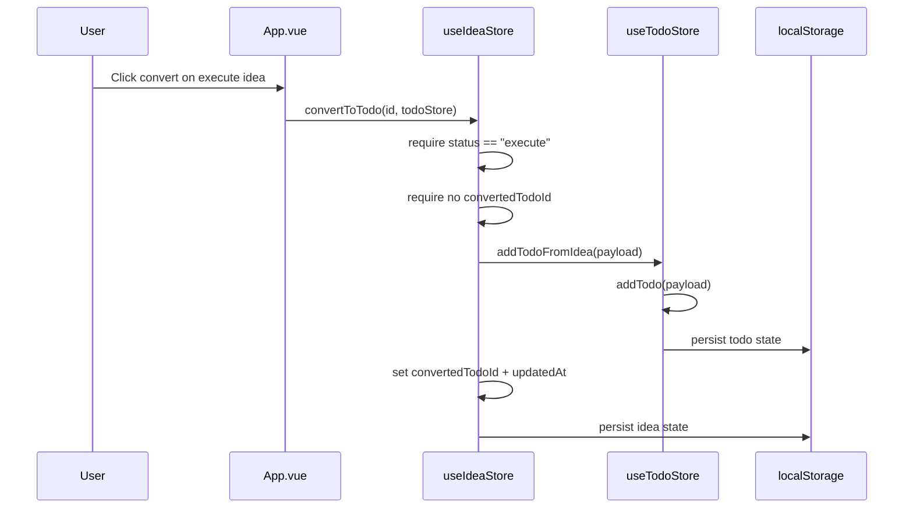
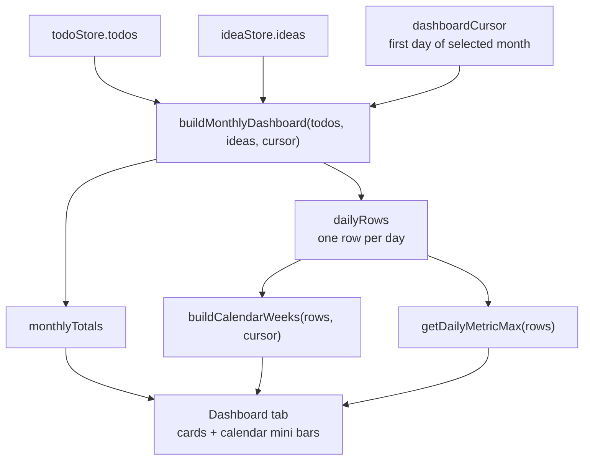
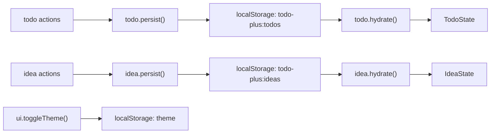

# Todo Plus Architecture Walkthrough

Audience: developers who need to understand, maintain, or extend Todo Plus.

Scope: runtime architecture, state ownership, UI-to-store flows, persistence, dashboard aggregation, and verification anchors. This walkthrough is based on the current code in `D:/projects/todo-plus`.

## Section Map

1. [One-screen Summary](#one-screen-summary)
2. [Architecture Map](#architecture-map)
3. [Source Layout](#source-layout)
4. [Runtime Boot](#runtime-boot)
5. [State Model](#state-model)
6. [Walkthrough: Todo Creation](#walkthrough-todo-creation)
7. [Walkthrough: Idea Board](#walkthrough-idea-board)
8. [Walkthrough: Idea to Todo Conversion](#walkthrough-idea-to-todo-conversion)
9. [Walkthrough: Dashboard Metrics](#walkthrough-dashboard-metrics)
10. [Persistence Contract](#persistence-contract)
11. [UI Composition](#ui-composition)
12. [Verification Anchors](#verification-anchors)
13. [Extension Points and Risks](#extension-points-and-risks)
14. [Reference Index](#reference-index)

## One-screen Summary

Todo Plus is a local-first Vue 3 + TypeScript app. The root component owns user interaction orchestration, Pinia stores own persistent domain state, and `src/lib` contains pure dashboard derivation logic.

| Concern | Current owner | Persistence | Notes |
| --- | --- | --- | --- |
| App bootstrap | [src/main.ts](D:/projects/todo-plus/src/main.ts:6) | none | Creates Vue app, installs Pinia, mounts `App`. |
| Screen orchestration | [src/App.vue](D:/projects/todo-plus/src/App.vue:27) | delegates to stores | Tabs, dialogs, form state, drag/drop, dashboard cursor. |
| Todo domain | [src/stores/todo.ts](D:/projects/todo-plus/src/stores/todo.ts:23) | `localStorage["todo-plus:todos"]` | CRUD, filtering, selection, bulk actions, idea conversion target. |
| Idea domain | [src/stores/idea.ts](D:/projects/todo-plus/src/stores/idea.ts:16) | `localStorage["todo-plus:ideas"]` | Kanban lanes, ordering, conversion into Todo. |
| UI preferences | [src/stores/ui.ts](D:/projects/todo-plus/src/stores/ui.ts:6) | `localStorage["theme"]` | Active tab in memory, theme persisted by class toggle. |
| Dashboard derivation | [src/lib/dashboard.ts](D:/projects/todo-plus/src/lib/dashboard.ts:95) | none | Computes monthly rows/totals from Todo and Idea timestamps. |

## Architecture Map



## Source Layout

```text
src/
  main.ts                  Vue bootstrap + Pinia registration
  App.vue                  Root screen, dialogs, tabs, workflows
  style.css                Global CSS variables and Tailwind layers
  components/
    forms/                 Thin dialog/form field components
    ui/                    Local UI primitives, mostly shadcn/radix-style wrappers
  lib/
    dashboard.ts           Pure monthly dashboard aggregation helpers
    utils.ts               Utility helper(s)
  stores/
    types.ts               Shared domain types
    todo.ts                Todo Pinia store
    idea.ts                Idea Pinia store
    ui.ts                  UI preference Pinia store
tests/
  components/              UI primitive tests
  stores/                  Pinia store behavior tests
  lib/                     Dashboard pure logic tests
```

## Runtime Boot

`main.ts` is intentionally thin:



The root component then hydrates local state on mount:



Source: [App.vue onMounted](D:/projects/todo-plus/src/App.vue:31), [todo hydrate](D:/projects/todo-plus/src/stores/todo.ts:46), [idea hydrate](D:/projects/todo-plus/src/stores/idea.ts:34), [ui hydrateTheme](D:/projects/todo-plus/src/stores/ui.ts:25).

## State Model

The shared domain type contract is small and explicit:

| Type | Fields | Source |
| --- | --- | --- |
| `Priority` | `low`, `medium`, `high` | [types.ts](D:/projects/todo-plus/src/stores/types.ts:1) |
| `TodoFilter` | `all`, `active`, `completed` | [types.ts](D:/projects/todo-plus/src/stores/types.ts:2) |
| `IdeaStatus` | `idea`, `evaluate`, `execute` | [types.ts](D:/projects/todo-plus/src/stores/types.ts:3) |
| `Todo` | title, description, completed, priority, dueDate, tags, timestamps | [types.ts](D:/projects/todo-plus/src/stores/types.ts:5) |
| `Idea` | title, description, status, priority, tags, order, optional convertedTodoId, timestamps | [types.ts](D:/projects/todo-plus/src/stores/types.ts:17) |



## Walkthrough: Todo Creation

Primary user path:



Key implementation points:

| Step | Source |
| --- | --- |
| Create dialog opens and sets `dialogType = "todo-create"` | [App.vue](D:/projects/todo-plus/src/App.vue:105) |
| Form submit routes Todo dialogs to `submitTodoForm()` | [App.vue](D:/projects/todo-plus/src/App.vue:203) |
| Payload trims title/description and splits tags | [App.vue](D:/projects/todo-plus/src/App.vue:158) |
| Store creates `Todo`, prepends it, persists, returns id | [todo.ts](D:/projects/todo-plus/src/stores/todo.ts:70) |
| Persistent sink writes `{ todos, selectedIds, filter, search }` | [todo.ts](D:/projects/todo-plus/src/stores/todo.ts:59) |

Related actions in the same store: `updateTodo`, `removeTodo`, `toggleTodo`, `toggleSelection`, `bulkCompleteSelected`, `bulkDeleteSelected`, `setFilter`, `setSearch`, and `addTodoFromIdea`.

## Walkthrough: Idea Board

Ideas move through a fixed three-lane lifecycle:



The lane list is defined in [idea.ts](D:/projects/todo-plus/src/stores/idea.ts:10). `byStatus` groups and sorts ideas by `order`, so the UI can render each lane directly from store getters.



Key implementation points:

| Step | Source |
| --- | --- |
| Lane statuses rendered from `statuses` | [App.vue](D:/projects/todo-plus/src/App.vue:244) |
| Drag start/drop stores dragged id and computes target index | [App.vue](D:/projects/todo-plus/src/App.vue:229) |
| Step movement validates lane bounds and recomputes order | [idea.ts](D:/projects/todo-plus/src/stores/idea.ts:70) |
| Drag movement rewrites source and target lane order | [idea.ts](D:/projects/todo-plus/src/stores/idea.ts:83) |
| `recomputeOrder()` normalizes each lane | [idea.ts](D:/projects/todo-plus/src/stores/idea.ts:106) |

## Walkthrough: Idea to Todo Conversion

Conversion is deliberately cross-store: the Idea store validates the source idea, then delegates Todo creation to the Todo store.



Source: [App.vue convertIdea](D:/projects/todo-plus/src/App.vue:240), [idea convertToTodo](D:/projects/todo-plus/src/stores/idea.ts:116), [todo addTodoFromIdea](D:/projects/todo-plus/src/stores/todo.ts:143).

Important guardrail: conversion returns `null` if the idea is missing, not in `execute`, or already converted. That makes the operation idempotent from the user's perspective.

## Walkthrough: Dashboard Metrics

The dashboard is derived, not stored. `App.vue` passes current Todo and Idea arrays into pure functions in `src/lib/dashboard.ts`.



Key implementation points:

| Step | Source |
| --- | --- |
| Dashboard computed state wires stores to pure aggregation | [App.vue](D:/projects/todo-plus/src/App.vue:258) |
| Calendar weeks computed separately from daily rows | [App.vue](D:/projects/todo-plus/src/App.vue:261) |
| Month cursor changes with `shiftMonth` | [App.vue](D:/projects/todo-plus/src/App.vue:289) |
| `buildMonthlyDashboard` builds day map and totals | [dashboard.ts](D:/projects/todo-plus/src/lib/dashboard.ts:95) |
| Invalid date strings are ignored by `toLocalDayKey` returning empty key | [dashboard.ts](D:/projects/todo-plus/src/lib/dashboard.ts:60) |
| Calendar uses Monday-first leading/trailing empty cells | [dashboard.ts](D:/projects/todo-plus/src/lib/dashboard.ts:43) |

## Persistence Contract



| Key | Writer | Reader | Stored payload |
| --- | --- | --- | --- |
| `todo-plus:todos` | [todo.persist](D:/projects/todo-plus/src/stores/todo.ts:59) | [todo.hydrate](D:/projects/todo-plus/src/stores/todo.ts:46) | `{ todos, selectedIds, filter, search }` |
| `todo-plus:ideas` | [idea.persist](D:/projects/todo-plus/src/stores/idea.ts:44) | [idea.hydrate](D:/projects/todo-plus/src/stores/idea.ts:34) | `{ ideas }` |
| `theme` | [ui.toggleTheme](D:/projects/todo-plus/src/stores/ui.ts:13) | external initial class + [ui.hydrateTheme](D:/projects/todo-plus/src/stores/ui.ts:25) | `"light"` or `"dark"` |

Hydration catches invalid JSON or unavailable localStorage reads and resets the affected store. Todo and Idea writes currently call `localStorage.setItem` without a surrounding `try/catch`, so quota/security errors would surface during mutation.

## UI Composition

`App.vue` is the current composition root. It imports UI primitives, form components, stores, and dashboard helpers in one place, then presents three top-level tabs:

| Tab | Responsibilities | Source |
| --- | --- | --- |
| Todo | Filter/search, list, selection, complete/delete, batch actions, create/edit dialog | [App.vue](D:/projects/todo-plus/src/App.vue:330) |
| Idea board | Lane rendering, drag/drop, step movement, conversion, create/edit dialog | [App.vue](D:/projects/todo-plus/src/App.vue:379) |
| Dashboard | Month navigation, totals, calendar heat bars, floating legend | [App.vue](D:/projects/todo-plus/src/App.vue:427) |

Form components are intentionally thin:

| Component | Role | Source |
| --- | --- | --- |
| `FormDialog` | Reusable modal shell with submit/cancel events | [FormDialog.vue](D:/projects/todo-plus/src/components/forms/FormDialog.vue:1) |
| `TodoFormFields` | Renders Todo-specific fields over a passed reactive object | [TodoFormFields.vue](D:/projects/todo-plus/src/components/forms/TodoFormFields.vue:1) |
| `IdeaFormFields` | Renders Idea-specific fields over a passed reactive object | [IdeaFormFields.vue](D:/projects/todo-plus/src/components/forms/IdeaFormFields.vue:1) |

## Verification Anchors

Use these tests as fast behavioral anchors when changing architecture:

| Area | Test file | Covered behavior |
| --- | --- | --- |
| Todo store | [tests/stores/todo.spec.ts](D:/projects/todo-plus/tests/stores/todo.spec.ts:5) | Add/update, filters/search, bulk complete/delete. |
| Idea store | [tests/stores/idea.spec.ts](D:/projects/todo-plus/tests/stores/idea.spec.ts:6) | Step movement, drag ordering, one-time conversion. |
| Dashboard lib | [tests/lib/dashboard.spec.ts](D:/projects/todo-plus/tests/lib/dashboard.spec.ts:39) | Monthly counts, month filtering, local day boundaries, invalid dates, calendar weeks. |
| UI primitives | [tests/components](D:/projects/todo-plus/tests/components) | Badge, button, dialog, input, tabs wrappers. |

Recommended validation commands:

```powershell
npm run test
npm run build
```

## Extension Points and Risks

| Topic | Current state | Practical implication |
| --- | --- | --- |
| `App.vue` orchestration size | Root component owns all workflows and view state. | Fine for this app size; split only when a workflow becomes hard to test or reuse. |
| Store write errors | `hydrate()` catches parse/read failures; Todo/Idea `persist()` writes do not catch. | If localStorage quota/security failures matter, wrap store writes and surface a UI-safe error path. |
| Cross-store conversion | Idea store accepts `todoStore` as a parameter. | Keeps dependency explicit, but conversion tests should always cover both stores together. |
| ID generation | Uses timestamp + random suffix. | Adequate for local-only usage; replace with stronger IDs only if syncing or imports are added. |
| Dashboard dates | Invalid dates are ignored by derived aggregation. | Good defensive behavior; keep this property if date inputs become more complex. |
| Persistence schema | No version field in localStorage payload. | Add schema version/migration only when data shape changes incompatibly. |

## Reference Index

| Category | File |
| --- | --- |
| App entry | [src/main.ts](D:/projects/todo-plus/src/main.ts:1) |
| Root component | [src/App.vue](D:/projects/todo-plus/src/App.vue:1) |
| Todo store | [src/stores/todo.ts](D:/projects/todo-plus/src/stores/todo.ts:1) |
| Idea store | [src/stores/idea.ts](D:/projects/todo-plus/src/stores/idea.ts:1) |
| UI store | [src/stores/ui.ts](D:/projects/todo-plus/src/stores/ui.ts:1) |
| Domain types | [src/stores/types.ts](D:/projects/todo-plus/src/stores/types.ts:1) |
| Dashboard logic | [src/lib/dashboard.ts](D:/projects/todo-plus/src/lib/dashboard.ts:1) |
| Vite config | [vite.config.ts](D:/projects/todo-plus/vite.config.ts:1) |
| Package scripts | [package.json](D:/projects/todo-plus/package.json:1) |

## Maintenance Notes

When changing a workflow, trace it in this order:

1. UI trigger in `App.vue`.
2. Form/dialog state update.
3. Store action call.
4. Store mutation.
5. `persist()` sink.
6. Existing store/lib tests.

That keeps changes grounded in the actual runtime path instead of only the store internals.
